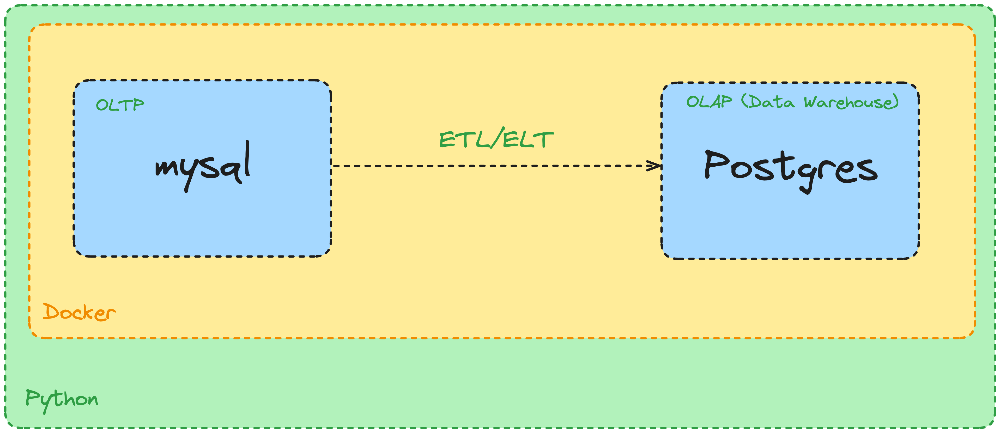

# Tools
1. Docker: https://docs.docker.com/desktop/install/windows-install/
2. Python

# How to
1. Open and start your Docker
2. Create the `docker-compose.yml` and create MySQL and Postgres Container declaratively
3. Run this command to make MySQL and Postgres Image run as a Container
    detached mode: `docker-compose up -d` run in background
    non-detached mode: `docker-compose up` run in foreground
4. Login to container `db-mysql` terminal using command without docker desktop `docker exec -it <container_id> bash`
5. Login to MySQL database: `mysql --local-infile=1 -uroot -pmysql operational < /docker-entrypoint-initdb.d/init.sql`
6. If error `Loading local data is disabled; this must be enabled on both the client and server sides` Run this query: `SET GLOBAL local_infile=1;` inside mysql database then re-run `LOAD DATA LOCAL INFILE` query.
7. Go to script directory and setup python virtual environment using `python -m venv env`
8. Activate env using `source env/bin/activate` in Windows we can use `env/Scripts/activate`
9. Install python requirements.txt using `python3 -m pip install -r requirements.txt` or `pip install -r requirements.txt`
10. Create database in postgresql:
    - `docker exec -it <postgres_container_id> bash`
    - login to postgres db using root user: `psql -Upostgres`
    - list databases run: `\l`
    - create database named `data_warehouse` using: `create database data_warehouse;` query
    - Choose database using `\c data_warehouse`
    - List tables inside database: `\d`

# references:
- https://towardsdatascience.com/upload-your-pandas-dataframe-to-your-database-10x-faster-eb6dc6609ddf
- https://medium.com/analytics-vidhya/importing-data-from-a-mysql-database-into-pandas-data-frame-a06e392d27d7
- https://medium.com/geekculture/run-docker-in-windows-10-11-wsl-without-docker-desktop-a2a7eb90556d
- https://community.sap.com/t5/technology-blogs-by-sap/how-to-find-out-ports-used-by-applications-on-windows/ba-p/13564904
